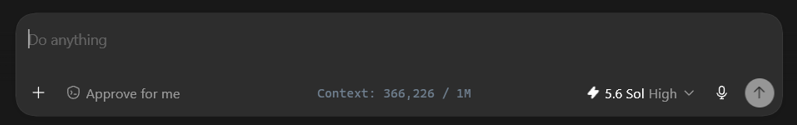
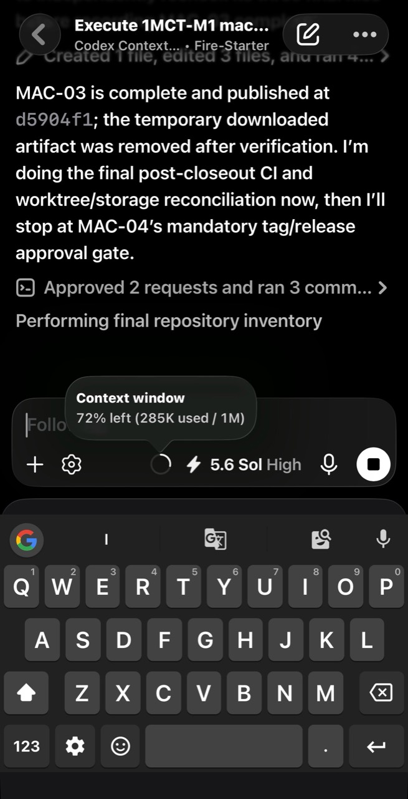

<h1 align="center">1M Context Ticker</h1>

<p align="center">
  
</p>

<h2 align="center">Windows and macOS downloads</h2>

| Platform | Download | Verify and install |
|---|---|---|
| Windows x64 | [`1M-Context-Ticker-Windows-x64.exe`](https://github.com/USS-Parks/1M-Context-Sol/releases/download/v0.1.0/1M-Context-Ticker-Windows-x64.exe) | [SHA-256](https://github.com/USS-Parks/1M-Context-Sol/releases/download/v0.1.0/1M-Context-Ticker-Windows-x64.exe.sha256) |
| macOS 14+ universal (`arm64` + `x86_64`) | [`1M-Context-Ticker-macOS-universal.dmg`](https://github.com/USS-Parks/1M-Context-Sol/releases/download/v0.1.0/1M-Context-Ticker-macOS-universal.dmg) | [Checksum-first macOS instructions](docs/MACOS.md) |

<p align="center">
  A lightweight native companion for Codex Desktop that shows the exact active-context count inside the composer and enables GPT-5.6 Sol's 1M catalog policy.
</p>

<p align="center">
  <strong>Public v0.1.0 release</strong> · Windows x64 · macOS 14+ universal
</p>

## Screenshots

### Desktop ticker

<p align="center">
  
</p>

<p align="center">The passive desktop ticker sits between the approval and model controls without intercepting input.</p>

### Same task on mobile

<p align="center">
  
</p>

<p align="center">Codex's built-in mobile indicator reports <code>285K used / 1M</code>.</p>

The mobile popup is Codex's native task indicator, not the Windows/macOS ticker overlay. It reflects the same host-reported 1M context window across clients.

## What it does

- Displays the live host-authored count as `Context: <tokens> / 1M`.
- Follows the freshest active root Codex Desktop task.
- Centers itself in the composer region and responds when the right sidebar opens or closes.
- Samples the Codex prompt color for a subdued light/dark appearance.
- Hides when Codex is absent, minimized, or not foreground.
- Uses one focusless, non-activating, single-instance overlay.
- Applies only the supported Sol catalog/window/compaction settings with reversible ownership.

1M Context Ticker never proxies prompts, replaces the Codex interface, blocks normal compaction, or stops/restarts Codex.

## Placement

The ticker sits on the Codex prompt pill's lower control row, centered between the approval and model controls. Its protected window is sized to the rendered text rather than a large fixed badge, so it stays visually quiet and avoids the surrounding controls.

## Capacity terms

| Term | Value | Meaning |
|---|---:|---|
| Catalog total | 1,050,000 | GPT-5.6 Sol model-catalog context window |
| Effective Codex budget | 1,008,000 | Host-reported task budget after Codex's 96% allowance |
| Ticker value | Live | `last_token_usage.total_tokens` for the active context |
| Automatic compaction | 900,000 | Normal Codex compaction threshold, scope `total` |
| Maximum input | 922,000 | Model input limit, distinct from total context |
| Maximum output | 128,000 | Model output limit |

The face deliberately says `/ 1M` for readability while status output and verification records retain the exact dimensions.

## Verify each active task

When Codex is foreground, the ticker displays the full click-through face `Context: <active tokens> / 1M` straight from the freshest host token event. The denominator is the host-reported window: any 1M-class budget (such as the observed `1,008,000`) renders as `/ 1M`, and a smaller host window renders its actual size (for example `/ 272K`) instead of making a false 1M claim. `Context: !` appears only when no valid token event can be read.

The ticker has no hover popup and does not intercept composer input. For exact diagnostics, run:

```powershell
powershell.exe -NoProfile -ExecutionPolicy Bypass -File .\overlay\manage-overlay.ps1 -Action Status
```

Require `one_m_context_verified : True`. `display_state : hidden-outside-foreground-codex` means the verified ticker is intentionally hidden because another app has focus. After installation, quit and reopen Codex normally, send another turn, and verify the active task this way. Live v0.1.0 testing observed an existing session re-resolve the changed model catalog after restart, but this may vary by Codex Desktop version; task age is not proof, and the active task's verified host window remains authoritative.

## Install the Windows release

The local Windows release artifact is [`dist/1M-Context-Ticker-Windows-x64.exe`](dist/1M-Context-Ticker-Windows-x64.exe). It is an unsigned, framework-dependent .NET Framework 4.8 x64 executable. The checked-in checksum and artifact manifest are produced from two source-identical clean builds.

From Windows PowerShell in this repository:

```powershell
powershell.exe -NoProfile -ExecutionPolicy Bypass -File .\ticker\windows\verify-release.ps1 -OutputDirectory .\dist
powershell.exe -NoProfile -ExecutionPolicy Bypass -File .\overlay\manage-overlay.ps1 -Action Plan
powershell.exe -NoProfile -ExecutionPolicy Bypass -File .\overlay\manage-overlay.ps1 -Action Install
```

An existing PowerShell-reference installation can migrate in place with `-Action Upgrade`; `-Action Rollback` restores that retained reference exactly.

Installation:

- copies the ticker under `%LOCALAPPDATA%\CodexContextOverlay`;
- creates ordinary Start Menu and Startup shortcuts;
- adds exactly four owned Codex configuration keys;
- preserves a byte-exact pre-install backup;
- does not stop, restart, or otherwise control Codex.

Quit and reopen Codex normally when convenient, then open **1M Context Ticker** from the Start menu once. Future Windows sign-ins launch the helper automatically; it remains hidden until Codex is foreground.

## Headless Linux and Paseo

Linux is a supported headless policy/verification surface for exact `codex-cli 0.145.0`; it does not reproduce the Windows/macOS composer overlay. The manager derives a compatible Sol entry from the installed CLI, owns only the four documented Codex keys, and never restarts Paseo or sends model traffic unless `verify --live` is explicitly invoked.

```bash
bash scripts/linux/manage-sol-policy plan
bash scripts/linux/manage-sol-policy install
bash scripts/linux/manage-sol-policy status
bash scripts/linux/manage-sol-policy verify
```

After install, start a fresh Paseo Codex agent with `--provider codex` or `--provider codex/gpt-5.6-sol`. An explicit different provider model such as `codex/gpt-5.4` remains authoritative and does not use the Sol policy. See [Headless Linux and Paseo](docs/LINUX-PASEO.md) for `CODEX_HOME`, compatibility, live verification, and safe uninstall details.

## Status, stop, and uninstall

```powershell
powershell.exe -NoProfile -ExecutionPolicy Bypass -File .\overlay\manage-overlay.ps1 -Action Status
powershell.exe -NoProfile -ExecutionPolicy Bypass -File .\overlay\manage-overlay.ps1 -Action Stop
powershell.exe -NoProfile -ExecutionPolicy Bypass -File .\overlay\manage-overlay.ps1 -Action Uninstall
```

`config_snapshot_matches` compares the entire current config with the post-install snapshot, so an unrelated Codex rewrite can make it false. `config_owned_values_match` checks only the four manifest-owned values and must remain true.

Uninstall stops only a verified ticker process, removes its two shortcuts and install directory, and restores owned configuration. If unrelated user/app settings changed after installation, those later changes are preserved.

## Verification

```powershell
powershell.exe -NoProfile -ExecutionPolicy Bypass -File .\overlay\Test-ContextOverlay.ps1
powershell.exe -NoProfile -ExecutionPolicy Bypass -File .\overlay\Test-OverlayInstaller.ps1
powershell.exe -NoProfile -ExecutionPolicy Bypass -File .\ticker\windows\verify-release.ps1 -OutputDirectory .\dist
```

Detailed local evidence is in:

- [Windows release verification](docs/VERIFICATION.md)
- [Desktop/overlay development log](docs/sessions/CODEX-DESKTOP-SOL-1M-DEVLOG.md)
- [Windows executable release log](docs/sessions/1M-CONTEXT-TICKER-RELEASE-DEVLOG.md)
- [Safe install and rollback evidence](docs/evidence/CDO-03/safe-install-and-rollback.md)
- [Headless Linux/Paseo installation and verification](docs/LINUX-PASEO.md)

## Privacy and safety

- Reads local Codex rollout metadata and `token_count` events.
- Does not display or transmit transcript content.
- Sends no model requests during plan, install, status, uninstall, or ordinary verification and uses no alternate API lane. Linux `verify --live` sends one request only after explicit opt-in.
- Does not modify the signed Codex package.
- Does not terminate Codex or its app-server.
- Uses no scheduled task, MCP server, browser service, or replacement chat client.

## Current limitations

- Public v0.1.0 visible ticker builds support Windows x64 and macOS 14+ universal (`arm64` and `x86_64`). Linux support is headless policy/verification only and currently pins exact Codex CLI 0.145.0.
- The visible surface is a separate focusless overlay, not a native Codex prompt-pill component.
- The Windows executable is unsigned, and the macOS DMG is unsigned and unnotarized. Windows PowerShell is used for Windows installation and verification, not as the running ticker process.
- Physical-Mac placement and real login-item/configuration acceptance remain unclaimed.
- Configuration and host-budget proof do not substitute for an unrun paid request above the previously tested live boundary.

## Historical implementation

Earlier Context Continuum/TUI, MCP, reservoir, and strict-compaction work remains in repository history and preserved source, but it is not the active product or installation path.

## License

Apache-2.0. See [LICENSE](LICENSE).
