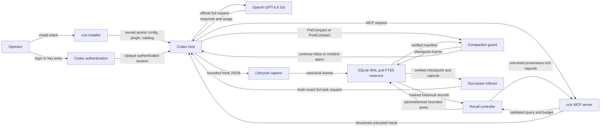

# Data Flow and Trust Boundaries

## Authority map

`contracts/architecture-boundaries.json` is the machine-readable source. Every component has one owner, a bounded input/output contract, and a fail-closed failure mode.

| Authority | Sole owner | What other components may do |
|---|---|---|
| Agent reasoning, tools, approvals, task lifecycle | OpenAI Codex | Observe documented events and request supported actions |
| Credentials and provider session | Codex authentication | Observe only a sanitized lane/status verdict |
| Global product installation | `cctx::install` | Generate owned artifacts and verification inputs |
| Sol model compliance verdict | `cctx::doctor` | Supply signed/hashed facts; never self-certify a backend |
| Durable context | `cctx::reservoir` | Submit validated events or bounded queries |
| Compaction decision | `cctx::guard` | Supply events/checkpoint verdicts; never bypass the block |

There is no second agent orchestrator, durable store, cloud transcript backend, or alternate-model router.

## Runtime flow

## Trust boundaries

| Boundary | Untrusted or controlled input | Required control | Fail-closed outcome |
|---|---|---|---|
| Operator to installer | Paths, requested mutation, environment | dry run, canonical path, ownership manifest, backup | refuse mutation |
| Operator to Codex auth | ChatGPT login or API credential | Codex-owned credential flow | lane unavailable |
| Codex to hook process | Hook envelope plus repository/tool/model text | schema, size, timeout, event-type validation | reject/quarantine or bounded error |
| Workspace/tool text to reservoir | Attacker-controlled filenames, source, logs, and prompt text | size limits, canonical schema, hashes, redaction | reject event or roll back |
| Reservoir to active model context | Historical text that can contain instructions | provenance, untrusted delimiters, token/byte budget | omit or structured error |
| MCP caller to store | Query, filters, IDs, export/delete scope | tool schema, namespace authorization, prepared statements | deny request |
| cctx to filesystem | Config, catalog, database, backup, export paths | canonicalization, ACL/mode checks, junction/symlink defenses, atomic writes | refuse access/mutation |
| PreCompact to persistence | Hard-limit event during possible partial writes | WAL barrier, snapshot, hash manifest, independent verification | block compaction and halt |
| Source task to successor | Recovery capsule, working directory, config/catalog identity | checkpoint hashes, bounded capsule, doctor preflight | reject successor |
| Release artifact to user machine | Binary/plugin/update archive | checksums, SBOM, provenance, archive inspection | refuse installation |

## Control flow constraints

1. A hook never performs model routing or broad recall.
2. MCP never changes active model/config and never grants stored text instruction authority.
3. The reservoir is the only mutable durable context store.
4. Credentials pass from the operator to Codex authentication, never through `cctx`.
5. A catalog overlay can change client policy but cannot certify server capacity.
6. A failed or partial checkpoint always produces a compaction block.
7. A successor starts only after its exact Sol policy and source checkpoint are verified.
8. Unknown Codex/catalog/hook/plugin schemas block compliance rather than falling back.

## Machine verification

`tests/architecture_boundaries.rs` verifies unique component and transition IDs, required component contracts, valid transition endpoints, exactly one declared owner for each authority, the complete high-risk boundary set, and the absence of forbidden parallel subsystems.
